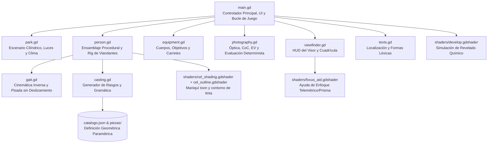
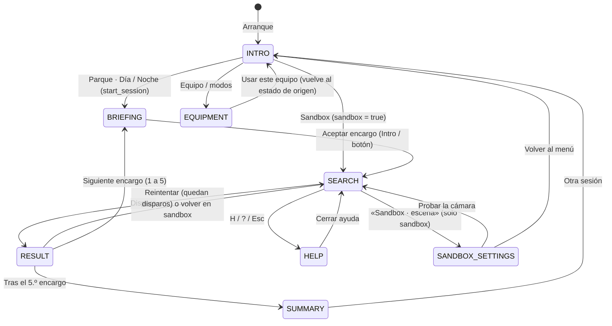

# Arquitectura Global del Sistema — Proyecto Paparazzi

Este documento describe la arquitectura modular, el flujo de datos, la máquina de estados y el pipeline de renderizado de **Proyecto Paparazzi**.

---

## 1. Visión General y Filosofía de Diseño

Proyecto Paparazzi es un simulador fotográfico 3D desarrollado en **Godot 4** que combina mecánicas de búsqueda visual con una simulación fotográfica matemáticamente determinista basada en las leyes reales de la óptica geométrica, fotometría analógica y cinemática de locomoción.

### Principios Fundamentales
- **Cero texturas de personajes**: Toda la multitud y el parque se renderizan mediante **colores de vértice** (`Mesh.ARRAY_COLOR`), eliminando transferencias de texturas y reduciendo drásticamente la memoria de vídeo (VRAM < 60 MiB).
- **Malla combinada de superficie única**: Cada personaje y el parque estático constan de una única superficie (`Mesh.ARRAY_VERTEX`, etc.), minimizando los *draw calls*.
- **Evaluación determinista e inmutable**: La fotografía tomada genera un expediente numérico cerrado (`evidence`). Dados los mismos parámetros de entrada, el algoritmo de puntuación en `photography.gd` produce exactamente el mismo resultado matemático.
- **Mundo cilíndrico centrado en el jugador**: El escenario se modela en coordenadas cilíndricas $(r, \theta, y)$ con la cámara del jugador situada permanentemente en el origen $(0, 1.60\text{ m}, 0)$.

---

## 2. Mapa de Módulos y Dependencias

El código está estructurado en módulos desacoplados sin dependencias circulares:



### Responsabilidades por Módulo

| Módulo | Archivo | Responsabilidad Principal |
|---|---|---|
| **Controlador** | [scripts/main.gd](../scripts/main.gd) | Máquina de estados, bucle principal, navegación 2D de viandantes, interacción ratón/táctil y gestión de interfaz de usuario. |
| **Escenario** | [scripts/park.gd](../scripts/park.gd) | Geometría procedural del parque, plazas, carriles concéntricos, farolas con sombras, ciclo día/noche y nubes procedurales. |
| **Viandantes** | [scripts/person.gd](../scripts/person.gd) | Ensamblado de piezas anatómicas, rig universal de 20 huesos, pesaje rígido y combinación en una sola superficie con colores de vértice. |
| **Locomoción** | [scripts/gait.gd](../scripts/gait.gd) | Cinemática analítica de marcha y carrera, cálculo de altura de cadera, orientación de suela y pisada con deslizamiento cero (`drift = 0`). |
| **Casting** | [scripts/casting.gd](../scripts/casting.gd) | Generación aleatoria de rasgos de vestimenta, asignación de encargos y concordancia morfológica estricta de género y número en español. |
| **Óptica y Foto** | [scripts/photography.gd](../scripts/photography.gd) | Fórmulas ópticas reales: CoC, profundidad de campo, triángulo de exposición, desenfoque por velocidad de obturación y calificación determinista. |
| **Equipo** | [scripts/equipment.gd](../scripts/equipment.gd) | Catálogo de cuerpos (compacta, telemétrica, réflex), objetivos fotográficos (24 mm a 200 mm), pasos de diafragma y carretes analógicos. |
| **Visor HUD** | [scripts/viewfinder.gd](../scripts/viewfinder.gd) | Dibujo analógico del visor réflex/telemétrico: 9 colimadores AF, cuadrícula de tercios, exposímetro analógico. La ayuda de enfoque en MF (imagen partida / doble imagen) la dibuja `focus_aid.gdshader`. |
| **Localización** | [scripts/texts.gd](../scripts/texts.gd) | Resolución de claves localizadas desde `data/textos.es.json` con interpolación de variables. |

---

## 3. Máquina de Estados del Juego

El flujo se gestiona en `main.gd` con la variable `mode`. El sandbox **no es un estado propio**: es la bandera `sandbox = true` durante `SEARCH`/`RESULT`.



`EQUIPMENT` se puede abrir desde la intro y desde la barra superior durante la partida; al cerrarse vuelve al estado desde el que se abrió (`equipment_return`).

### Detalle de Estados

1. **`INTRO`**: Pantalla inicial: Parque · Día, Parque · Noche, Sandbox y Equipo / modos.
2. **`BRIEFING`**: Ficha del encargo con retrato 3D del objetivo (`brief_preview`) y sus rasgos descriptivos. El parque queda pausado durante la lectura.
3. **`SEARCH`**: Fase activa: los viandantes se mueven, el jugador encuadra, enfoca, ajusta la exposición y dispara. Cada encargo tiene 3 disparos (ilimitados en sandbox).
4. **`RESULT`**: Foto revelada con `develop.gdshader` y desglose de `Photo.evaluate()`: nota de 0 a 100, estrellas (0–5) y créditos (0–150). Cuenta la mejor foto del encargo.
5. **`SUMMARY`**: Tras los 5 encargos: encargos superados (≥ 3 estrellas), créditos totales y la mejor fotografía.
6. **`HELP`**: Ayuda de controles; pausa la partida.
7. **`EQUIPMENT`**: Selección de cuerpo, objetivo, modo de foco, exposición y soporte (ver [EQUIPAMIENTO_Y_OPTICAS.md](EQUIPAMIENTO_Y_OPTICAS.md)).
8. **`SANDBOX_SETTINGS`**: Panel de escena del sandbox: día/noche, nubes y personajes en movimiento o quietos.

---

## 4. Pipeline de Fotograma y Renderizado

El proyecto utiliza el renderizador **`gl_compatibility`** de Godot 4 (basado en OpenGL Core Profile / WebGL), garantizando compatibilidad multiplataforma y ejecución fluida en hardware de baja potencia.

```
+-------------------------------------------------------------------+
|                        BUCLE DE FOTOGRAMA                         |
+-------------------------------------------------------------------+
  1. _process(dt):
     a) Actualización de entrada (arrastre ratón / deslizamiento táctil).
     b) Giro angular de cámara: angle (yaw) y pitch (tilt).
     c) Park: actualización de nubes, posición solar y lectura de EV.
     d) Main: actualización de los 21 viandantes (update_person).
        - Steering espacial 2D y evasión de obstáculos.
        - Transición diagonal entre carriles si corresponde.
        - Sincronización de locomoción con gait.gd (pisada sin deslizamiento).
     e) Viewfinder: dibujo vectorial HUD del visor (puntos AF, exposímetro).
  
  2. Disparo fotográfico (take_photo):
     a) Captura de expediente determinista (posiciones, CoC, EV, trepidación).
     b) Evaluación de 5 rayos de oclusión física contra geometría real.
     c) Captura del Viewport en Image.
     d) Calificación en photography.gd: nota 0-100, estrellas 0-5 y créditos 0-150.
     e) Procesamiento en develop.gdshader con los valores de la calificación
        (desenfoque CoC, arrastre, trepidación, exposición y grano).
```

---

## 5. Proporción de Pantalla y Ancho de Sensor Fijo

- **Relación de aspecto fija**: **16:9** bloqueada en `project.godot` (`1280x720` nativo, override `1440x810`).
- **Modo de cámara**: `camera.keep_aspect = Camera3D.KEEP_WIDTH`.
- **Sensor de referencia**: Formato completo **36 × 24 mm** (ancho de sensor fijo en 36 mm). Al fijar el ancho con `KEEP_WIDTH`, el campo de visión horizontal ($\text{HFOV}$) se calcula directamente a partir de la distancia focal $f$:
  $$\text{HFOV} = 2 \cdot \arctan\left(\frac{36\text{ mm}}{2 \cdot f}\right)$$
  Esto asegura que cambiar la relación de la ventana nunca distorsione las fórmulas fotográficas ni la magnificación del sujeto.

---

## 6. Documentos de Referencia Relacionados
- [docs/NAVEGACION_Y_COLISIONES.md](NAVEGACION_Y_COLISIONES.md): Algoritmos 2D de navegación, carriles y evasión.
- [docs/PERSONAJES_Y_CINEMATICA.md](PERSONAJES_Y_CINEMATICA.md): Modelado procedural, rig de 20 huesos y marcha analítica.
- [docs/SIMULACION_FOTOGRAFICA.md](SIMULACION_FOTOGRAFICA.md): Fórmulas ópticas, CoC, fotometría y calificación.
- [docs/EQUIPAMIENTO_Y_OPTICAS.md](EQUIPAMIENTO_Y_OPTICAS.md): Cámaras, objetivos y visor.
- [docs/ESCENARIO_Y_RENDIMIENTO.md](ESCENARIO_Y_RENDIMIENTO.md): Parque cilíndrico, iluminación y presupuestos.
- [docs/TESTS_Y_VERIFICACION.md](TESTS_Y_VERIFICACION.md): Comandos de prueba y cifras de referencia (fuente única).
