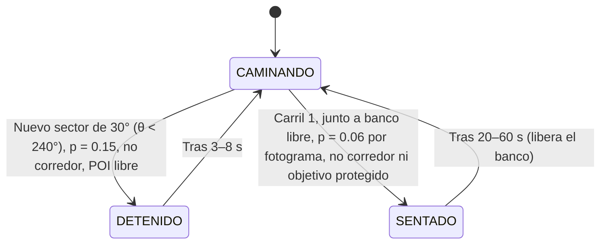

# Navegación 2D, Carriles y Prevención de Colisiones — Proyecto Paparazzi

Este documento detalla el modelo de desplazamiento bidimensional, el trazado de carriles concéntricos, el sistema de dirección anticipatoria (*steering*), la resolución de colisiones y los mecanismos deterministas anti-bloqueo (*anti-deadlock*) implementados en **Proyecto Paparazzi**.

---

## 1. Modelo de Desplazamiento y Coordenadas Cilíndricas

Dado que todos los viandantes caminan a nivel constante de suelo ($y = 0$), el movimiento se modela sobre el **plano horizontal 2D $(x, z)$** expresado en **coordenadas cilíndricas** $(r, \theta)$ con origen en el jugador:

$$\begin{cases}
x = r \cdot \sin(\theta) \\
z = -r \cdot \cos(\theta)
\end{cases}$$

La función de conversión en `park.gd` es:
```gdscript
func polar(theta: float, radius: float) -> Vector3:
    return Vector3(sin(deg_to_rad(theta))*radius, 0, -cos(deg_to_rad(theta))*radius)
```

La velocidad lineal $v$ se traduce en **velocidad angular** $\omega$:
$$\omega = \frac{v}{r} \quad (\text{rad/s}) \implies \Delta\theta = \text{rad\_to\_deg}\left(\frac{v}{r}\right) \cdot \Delta t \cdot \text{direction}$$

---

## 2. Estructura de Carriles y Capacidad de Aforo

El parque cuenta con **4 calzadas peatonales circulares concéntricas** donde circulan los **21 viandantes**:

| Carril | Radio Nominal ($r$) | Sub-offset ($\pm$) | Límites Físicos (`LANE_BOUNDS`) | Población | Aforo Máx. (`LANE_CAPACITIES`) | Función en el Juego |
|:---:|:---:|:---:|:---:|:---:|:---:|---|
| **0** | $1.8\text{ m}$ | $0.33\text{ m}$ | $[1.20, 2.40]\text{ m}$ (ancho: $1.20\text{ m}$) | 3 | 3 | Primer plano de oclusión dinámica |
| **1** | $4.0\text{ m}$ | $0.35\text{ m}$ | $[2.90, 4.85]\text{ m}$ (ancho: $1.95\text{ m}$) | 7 | 7 | Plaza central / Sujeto principal |
| **2** | $7.0\text{ m}$ | $0.35\text{ m}$ | $[6.10, 7.90]\text{ m}$ (ancho: $1.80\text{ m}$) | 6 | 7 | Tránsito intermedio y encargos secundarios |
| **3** | $11.5\text{ m}$ | $0.35\text{ m}$ | $[10.60, 12.40]\text{ m}$ (ancho: $1.80\text{ m}$) | 5 | 6 | Tránsito perimetral lejano |

**Población** es el reparto inicial de `populate()` (`counts = [3, 7, 6, 5]`, 21 en total); **aforo** es el máximo que `try_change_lane()` admite tras los cambios de carril (`LANE_CAPACITIES = [3, 7, 7, 6]`).

### Despeje de Calzadas y Obstáculos Físicos
Para asegurar que la calzada del carril 1 mantenga más de $1.9\text{ m}$ de paso continuo sin barreras:
- **Bancos reducidos a 4**: Desplazados al borde exterior a **$r = 4.85\text{ m}$** y orientados hacia el centro a $90^\circ$ ($\theta = 35^\circ, 125^\circ, 215^\circ, 305^\circ$).
- **Farolas interiores**: Reubicadas a **$r = 0.8\text{ m}$** (dentro del alcorque central) para no invadir el Carril 0 ($r = 1.8\text{ m}$).

---

## 3. Navegación Continua 2D y Dirección Sensible al Espacio

En cada fotograma, `update_person(p, dt)` calcula la trayectoria de avance anticipando obstáculos mediante tres fuerzas combinadas:

### 3.1 Sub-carriles por Sentido de Marcha
Los viandantes en sentido horario (`direction = 1`) tienden a su sub-radio exterior ($r_{\text{nom}} + \text{offset}$), mientras que los de sentido antihorario (`direction = -1`) tienden al interior ($r_{\text{nom}} - \text{offset}$).
Esto proporciona una **separación natural de $\ge 0.70\text{ m}$**, permitiendo que dos viandantes en sentidos opuestos se crucen sin rozarse.

### 3.2 Detección Frontal y Evasión Lateral Sensible al Espacio
Para cada otro viandante visible, se considera "delante" si la distancia de arco en el sentido de marcha está en $(0.02, 2.5)\text{ m}$ y la distancia euclídea es menor de $2.5\text{ m}$. Con
```gdscript
var space_out = bounds.y - other.radius
var space_in = other.radius - bounds.x
```
se elige un sentido de desvío por este orden:
1. Si `space_out < 0.65` → hacia dentro; si `space_in < 0.65` → hacia fuera (el otro está pegado a un borde).
2. **Mismo sentido (adelantamiento)**: hacia el lado con más holgura (`space_out >= space_in` → fuera).
3. **Sentido opuesto con $|\Delta r| < 0.75\text{ m}$**: hacia el propio sub-carril (fuera si `direction > 0`).

Cada obstáculo aporta su voto ponderado por cercanía, $w = (2.5 - \text{dist}) / 2.5$. Si la suma no es nula, el radio objetivo pasa a $r_{\text{nom}} \pm 0.38\text{ m}$ (carriles 0 y 1) o $\pm 0.48\text{ m}$ (carriles 2 y 3), acotado a `LANE_BOUNDS`. El radio se acerca al objetivo a $1.4 \cdot v$ m/s.

**Frenado**: si el obstáculo más cercano está a menos de $0.90\text{ m}$ y con $|\Delta r| < 0.52\text{ m}$, la velocidad se multiplica por $\text{clamp}((\text{dist} - 0.40)/0.50,\ 0.20,\ 1.0)$.

**Pasos de reserva**: si el paso 2D completo no es válido (`travel_clear`), se prueba en orden: solo radial, solo tangencial, tangencial con desvío de $+0.12\text{ m}$ y con $-0.12\text{ m}$. Si ninguno pasa, se acumula `stuck_time` (§5).

### 3.3 Transición Diagonal entre Carriles
Cuando un viandante cambia de carril (`destination_lane >= 0`):
- Avanza **diagonalmente**: radio hacia el sub-carril destino a $0.7 \cdot v$ m/s y avance tangencial a $0.5 \cdot v$.
- Si el paso diagonal no es válido prueba solo el radial y luego solo el tangencial. Se considera llegado a menos de $0.15\text{ m}$ del radio destino.
- Si lleva más de $1.2\text{ s}$ bloqueado (`lane_change_blocked`), cancela el cambio y adopta el carril nominal más cercano a su radio actual.
- Además, cada $8 - 18\text{ s}$ (`lane_timer`) intenta un cambio de carril espontáneo.

### 3.4 Control de Aforo (`LANE_CAPACITIES`)
Antes de permitir un cambio de carril, `try_change_lane()` contabiliza cuántos viandantes ocupan o se dirigen al carril destino:
```gdscript
if in_lane >= LANE_CAPACITIES[lane]: continue
```
Esto previene que el Carril 0 (de solo 11.3 m de perímetro) reciba demasiados viandantes y se congestione.

---

## 4. Algoritmo de Despeje Físico (`travel_clear`)

La función `travel_clear(p, from, to)` valida si un segmento de desplazamiento es seguro antes de comprometer la nueva posición del personaje:

```gdscript
func travel_clear(p: Pedestrian, from: Vector3, to: Vector3) -> bool:
```

### Componentes de Validación
1. **Barrido de cápsula 3D (`CapsuleShape3D`) contra el mundo estático**:
   - Radio: $0.30\text{ m}$, altura: altura anatómica del personaje.
   - Consulta de intersección y `cast_motion` en `collision_mask = 2` (árboles, bancos, papeleras, farolas).
2. **Distancia mínima entre personajes ($0.58\text{ m}$)**:
   - Se obtiene el punto más cercano del segmento de avance respecto a los demás viandantes (`Geometry3D.get_closest_point_to_segment`).
   - **Desbloqueo de pasos de separación**: Si la distancia final $d_{to}$ es mayor o igual que la distancia inicial $d_{from} - 0.005\text{ m}$, el paso se autoriza aunque los personajes estén cerca. Esto permite que los viandantes se separen libremente sin bloquearse mutuamente.

---

## 5. Máquina de Estados de Viandantes y Anti-Deadlock

El estado vive en `person.gd::state` y se actualiza en `main.gd::update_person()`:



- **DETENIDO** es una pausa de "punto de interés", no un mecanismo anti-atascos.
- **RETIRADO**: `update_person()` y el sorteo de objetivos contemplan este estado (reaparición en $\theta = 296^\circ / 304^\circ$, detrás del jugador), pero **ningún código lo asigna actualmente**; la rama es inalcanzable en el juego.

### Escalado Anti-Deadlock
Cuando todos los pasos de §3.2 fallan, `stuck_time` crece con `dt` (y decrece cuando el viandante logra avanzar):
1. **$t_{\text{stuck}} > 0.8\text{ s}$**: intenta cambiar a un carril con aforo libre (`try_change_lane()`, carriles ordenados por cercanía de radio).
2. **$t_{\text{stuck}} > 2.5\text{ s}$**: invierte su sentido de marcha (`direction *= -1`) y reinicia `stuck_time`.

### Puntos de Interés (POI) sin Congestión
Antes de detenerse, el viandante comprueba que ningún otro en el mismo carril esté `DETENIDO` o `SENTADO` a menos de $12^\circ$.

---

## 6. Verificación Determinista de Navegación

Suites `tests/simulate_jams.gd` y `tests/test_navigation.gd` (requieren display). Comandos y criterios en [TESTS_Y_VERIFICACION.md](TESTS_Y_VERIFICACION.md).
