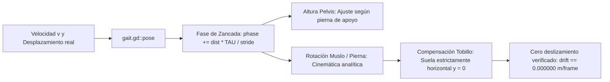

# Personajes, Rigging y Cinemática de Marcha — Proyecto Paparazzi

Este documento describe el modelado procedural de personajes, la jerarquía de huesos, el pesaje rígido, la optimización de superficie única y la cinemática inversa analítica implementada en **Proyecto Paparazzi**.

---

## 1. Perfiles Anatómicos Paramétricos

La población se genera proceduralmente a partir de **4 complexiones anatómicas** declaradas en `data/catalogo.json`:

| Perfil | Altura ($h$) | Hombros | Relación Cabeza | Radio Articular ($j$) | Zancada Base (`zancada`) |
|---|:---:|:---:|:---:|:---:|:---:|
| **0. Adulto Estándar** | $1.75\text{ m}$ | $0.42\text{ m}$ | $1 : 7.0$ | $0.045\text{ m}$ | $1.446\text{ m}$ |
| **1. Adulto Delgado** | $1.80\text{ m}$ | $0.36\text{ m}$ | $1 : 7.5$ | $0.038\text{ m}$ | $1.503\text{ m}$ |
| **2. Adulto Robusto** | $1.70\text{ m}$ | $0.52\text{ m}$ | $1 : 6.4$ | $0.055\text{ m}$ | $1.382\text{ m}$ |
| **3. Niño / Niña** | $1.15\text{ m}$ | $0.28\text{ m}$ | $1 : 4.5$ | $0.032\text{ m}$ | $0.862\text{ m}$ |

La zancada es la longitud de un **ciclo completo** (dos pasos) y es la base de `gait.gd`; `person.gd` la multiplica por $0.8$ en caminantes y por $1.4$ en corredores. En los cuatro perfiles vale $\approx 0.9637 \cdot NZ$ (proporcional a la longitud de pierna): si se cambia `altura` o `relacion_cabeza` en `catalogo.json`, hay que recalcularla con esa regla.

Las cabezas son algo mayores que las de una figura realista (p. ej. 1:7 en el adulto estándar) para que peinados y tocados, que forman parte de los encargos, se lean a distancia. Las extremidades se engrosaron en la misma revisión; los brazos, menos que las piernas, porque a la altura de la cintura ya rozan el torso y de frente se fundirían con él.

### Escalado Anatómico por Base del Cráneo ($NZ$)
Para que las extremidades de los menores no se deformen ni requieran tablas ad-hoc, las alturas articulares se calculan en función de $NZ$ (altura sin cabeza):
$$NZ = h - \frac{h}{\text{relación\_cabeza}}$$

- **Altura de cadera (entrepierna)**: $y_{\text{hip}} = NZ \cdot 0.542$
- **Rodilla**: $y_{\text{knee}} = NZ \cdot 0.323$
- **Tobillo**: $y_{\text{ankle}} = NZ \cdot 0.030$
- **Cintura**: $y_{\text{waist}} = NZ \cdot 0.692$

---

## 2. Esqueleto Universal de 20 Huesos y Rigging Rígido

Todos los viandantes comparten una **única estructura jerárquica de 20 huesos** en un nodo `Skeleton3D`:

```
raiz (0)
└── caderas (1)
    ├── lumbar (2)
    │   └── torax (3)
    │       ├── cuello (4)
    │       │   └── cabeza (5)
    │       ├── brazo.I (6) ── antebrazo.I (7) ── mano.I (8)
    │       └── brazo.D (9) ── antebrazo.D (10) ── mano.D (11)
    ├── muslo.I (12) ── pierna.I (13) ── pie.I (14) ── punta.I (15)
    └── muslo.D (16) ── pierna.D (17) ── pie.D (18) ── punta.D (19)
```

### Invariante de Pesaje Rígido (Single Bone Weight)
- Cada vértice de la malla de un personaje pertenece **única y exclusivamente a 1 hueso con peso 1.0**:
  - `ARRAY_WEIGHTS`: `weights[0] = 1.0`, `weights[1..3] = 0.0`.
  - `ARRAY_BONES`: `bones[0] = bone_index`, `bones[1..3] = 0`.
- **Beneficio técnico**: El hardware gráfico no necesita calcular matrices de deformación interpoladas multihueso (*dual quaternion* o *linear blend skinning*). En el método `gl_compatibility` (OpenGL / WebGL), esto reduce el coste del vertex shader a una simple transformación afín rígida, permitiendo animar multitudes de personajes fluidamente a 60 FPS.

---

## 3. Ensamblaje en Malla de Superficie Única y Colores de Vértice

Cada personaje combina múltiples prendas (torso, pantalones/falda, peinado, calzado, bufanda/sombrero):

1. **Piezas Paramétricas (`data/piezas/`)**:
   - Geometrías compactas definidas en JSON y generadas por `tools/build_catalog.py`: secciones elípticas unidas (*lofts*) con normales suaves, más algunos elipsoides, cajas y paneles planos (solapas, cremalleras).
   - Tras editar el generador hay que regenerar con `python3 tools/build_catalog.py`. Aviso: el generador produce diferencias de coma flotante del orden de $10^{-16}$ en piezas no modificadas (según la versión de Python); conviene no incluir esos ficheros en el commit.
2. **Superficie Única Combinada**:
   - En lugar de crear múltiples nodos `MeshInstance3D`, `person.gd` concatena los vértices, normales, índices y pesos de todas las piezas en un único arreglo para llamar a `Mesh.add_surface_from_arrays()`.
   - **Resultado**: Exactamente **1 draw call por personaje**.
3. **Coloreado por Vértice (`Mesh.ARRAY_COLOR`)**:
   - Los colores se asignan como atributo de color en cada vértice (`ARRAY_COLOR`), sin texturas PNG ni materiales individuales en GPU. Cada forma de una pieza declara una **zona de color** que `person.gd::setup()` resuelve:

     | Zona | Origen del color |
     |---|---|
     | `piel` | Madera: `tonos_madera[madera_por_tono[t.skin]]` (arce, haya, roble o nogal) |
     | `pelo` | `tonos_pelo[t.hair_color]` |
     | `tela_a` / `tela_b` | `tonos_ropa` de la prenda superior / inferior |
     | `accesorio` | `tonos_ropa[t.accessory_color]` |
     | `acento` | Blanco roto fijo (zapatillas y franjas deportivas) |
     | `calzado` | `tonos_calzado` (negro, marrón, blanco, gris) |

   - **Estilo maniquí** (subfases 2.1 y 2.2 de [futuro/02](futuro/02_ESTILO_VISUAL_Y_POLIGONOS.md)):
     - Material único compartido (`Person.mannequin_material()`) con [`cel_shading.gdshader`](../shaders/cel_shading.gdshader), luz en 3 bandas (iluminada 0,85, media 0,5 y sombra), y como `next_pass` [`cel_outline.gdshader`](../shaders/cel_outline.gdshader), un contorno de tinta por casco invertido de 1,6 px (máx. 12 mm). El contorno vuelve a dibujar los triángulos de cada viandante: el número de triángulos de la malla no cambia, pero el trabajo de rasterizado de los personajes se duplica.
     - Los paneles de doble cara (solapas, cremalleras, bolsillos, franjas deportivas) llevan `outline: false` en su JSON; `person.gd` les pone alfa 0 en los vértices y el shader de contorno los colapsa, porque si no el casco los cubría de negro. El alfa no se usa para transparencia.
     - Rótulas visibles: esferas un 22 % más oscuras y más gruesas que el miembro en codos, rodillas y muñecas cuando no hay ropa encima, y en la base del cuello.
   - **Oclusión ambiental precalculada** (`person.gd::occlusion()`): al combinar la malla, cada vértice oscurece el color de su zona hasta un 40 % según tres términos: caras que miran hacia abajo, caras interiores de brazos y muslos (que miran al eje del cuerpo) y cercanía al suelo. Da volumen a las zonas de color planas sin coste de render ni texturas.
   - **Calzado**: el color se deriva de los rasgos con un hash (`Person.shoe_color()`), **sin consumir el generador aleatorio**, para no alterar el reparto de encargos ni la navegación, y para que el retrato del encargo coincida con el viandante. El pantalón de vestir solo lleva negro o marrón. No forma parte de los predicados de los encargos.
4. **Uniones sin huecos** (verificado en `test_art.gd`, "GARMENT CHECKS"):
   - **Cadera**: el asiento del pantalón (`caderas`) tiene aberturas laterales elevadas para las piernas; en pantalones y shorts el muslo continúa $0.075 \cdot NZ$ por encima de la articulación para rellenarlas. En falda no se prolonga (asomaría por la cintura) y la falda es más ancha arriba para cubrir los muslos.
   - **Hombros**: la esfera del hombro no es más ancha que la manga y usa 3 anillos (`person.gd::ellipsoid()`), para que no forme una hombrera ni un pico.
   - **Cabeza**: el casquete del pelo es un *loft* de 10 segmentos (antes se generaba con 8 mientras el código de la línea frontal y del recorte suponía 10, lo que dejaba picos dentados). La gorra tiene copa propia cerrada y una visera curva que solo sale hacia delante (`visor_mesh()` en `build_catalog.py`); antes era un aro que atravesaba la cabeza y de frente parecía un halo.
   - La falda es más ancha que los muslos a la altura de la cadera (`test_art.gd` lo mide) para que no asomen por los lados.
   - Comparativas antes/después de estas correcciones: [general](evidencias/comparativas/uniones_calzado_1_general.png), [cadera](evidencias/comparativas/uniones_calzado_2_cadera.png), [en movimiento](evidencias/comparativas/uniones_calzado_3_movimiento.png), [hombros](evidencias/comparativas/uniones_calzado_4_hombros.png) y [calzado](evidencias/comparativas/uniones_calzado_5_calzado.png). Cabeza y proporciones: [gorra](evidencias/comparativas/cabeza_1_gorra.png), [pelo](evidencias/comparativas/cabeza_2_pelo.png), [proporciones](evidencias/comparativas/proporciones_1_general.png) y [proporciones en movimiento](evidencias/comparativas/proporciones_2_movimiento.png). Sombreado y revisión: [oclusión](evidencias/comparativas/sombreado_1_oclusion.png), [lineup](evidencias/comparativas/revision_1_lineup.png) y [hoja de prendas](evidencias/comparativas/revision_2_prendas.png). Estilo maniquí: [general](evidencias/comparativas/maniqui_1_general.png), [lineup](evidencias/comparativas/maniqui_2_lineup.png), [parque](evidencias/comparativas/maniqui_3_parque.png) y [vistas](evidencias/comparativas/maniqui_4_vistas.png).
5. **Presupuesto Geométrico**:
   - Límite máximo: **1.900 triángulos por viandante** (`test_art.gd`).
   - Valor medido actual (máximo del catálogo): ver [TESTS_Y_VERIFICACION.md §5](TESTS_Y_VERIFICACION.md).

---

## 4. Cinemática Inversa y Locomoción Analítica (`gait.gd`)

El archivo [scripts/gait.gd](../scripts/gait.gd) implementa un modelo de cinemática analítica en tiempo real para las extremidades inferiores.



### 4.1 Frecuencia y Zancada
La fase de locomoción $\phi \in [0, 2\pi)$ avanza en función de la distancia real recorrida en cada fotograma:
$$\Delta \phi = \frac{\Delta \text{distancia} \cdot 2\pi}{\text{zancada}}$$

Al alimentar $\Delta \text{distancia} = \|\mathbf{p}_{t} - \mathbf{p}_{t-1}\|$, la animación de los pies se desacopla del framerate y se sincroniza con exactitud milimétrica al avance físico.

### 4.2 Orientación de Suela Horizontal y Cabeceo de Pelvis
- **Suela paralela al suelo**: El ángulo del hueso `pie` compensa en cada instante la suma de rotaciones del muslo y la pantorrilla, asegurando que la suela permanezca estrictamente horizontal en contacto con el suelo ($y = 0$).
- **Cabeceo de cadera**: La posición vertical de la pelvis desciende en el contacto inicial (~6 cm) y se eleva en la posición de paso medio (~1 cm), emulando el movimiento biomecánico natural.

### 4.3 Diferenciación Marcha vs. Carrera
- **Caminantes** ($v \in [0.55, 0.85]\text{ m/s}$): Zancada base del perfil $\times 0.8$ (p. ej. $1.446 \times 0.8 \approx 1.16\text{ m}$ en el adulto estándar); braceo suave de brazos; siempre hay al menos un pie en contacto con el suelo.
- **Corredores** ($v \in [2.6, 3.0]\text{ m/s}$):
  - Ropa deportiva exclusiva (accesorios sueltos desactivados).
  - Zancada base del perfil $\times 1.4$.
  - Codos flexionados en ángulo pronunciado ($> 60^\circ$).
  - Fase aérea balística: periodo del ciclo donde ambos pies están en el aire simultáneamente.

---

## 5. Reglas Éticas de Casting y Concordancia Gramatical

El generador de personajes en [scripts/casting.gd](../scripts/casting.gd) respeta las siguientes reglas de diseño:

1. **Principio Ético Invariable**:
   - El **tono de piel nunca se utiliza para identificar al objetivo**, ni forma parte de las descripciones o predicados de los encargos.
   - Los cuerpos son **maniquíes de madera** (arce, haya, roble o nogal). El rasgo interno sigue llamándose `skin` y conserva sus claves (`clara`, `media`, `morena`, `oscura`) para no alterar el sorteo de `casting.gd`; solo se usa para elegir el acabado de madera (`madera_por_tono`), y `test_art.gd` comprueba que ningún vértice conserva un tono de piel.
2. **Concordancia Gramatical Estricta en Español**:
   - Cada prenda en `catalogo.json` declara su género y número morfológico:
     - `pantalones`: masculino plural (`"los pantalones verdes"`).
     - `falda`: femenino singular (`"la falda plisada"`).
     - `chaqueta`: femenino singular (`"una chaqueta roja"`).
   - El sistema de concordancia en `casting.gd` ajusta artículos y adjetivos cromáticos para garantizar descripciones naturales y gramaticalmente impecables en español.

---

## 6. Verificación Automatizada

Suites `tests/test_art.gd` y `tests/test_gait.gd` (headless). Comandos, volumen y criterios en [TESTS_Y_VERIFICACION.md](TESTS_Y_VERIFICACION.md).
